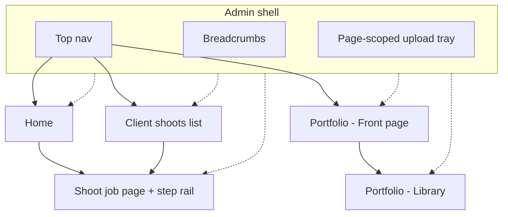
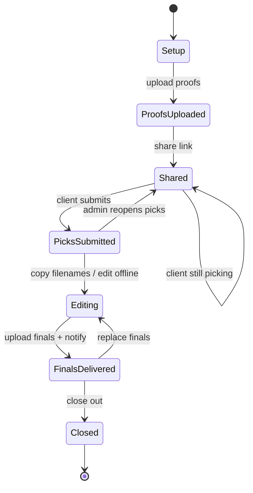
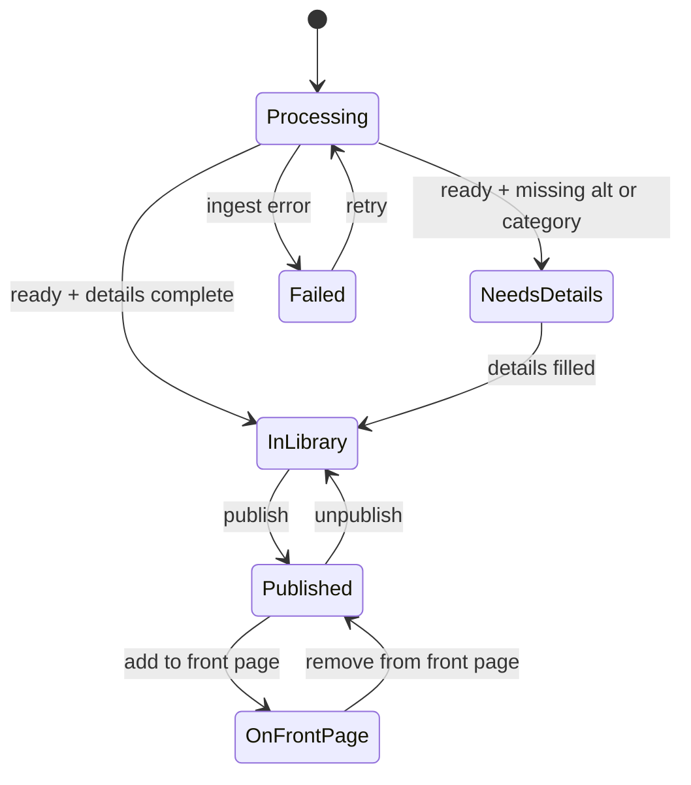

# Admin UX (v2)

Canonical workflows and interaction patterns for `/admin`. Architecture and auth stay in [HLD.md](HLD.md). Hydration and libraries stay in [FRONTEND.md](FRONTEND.md). Sequencing for build work: [IMPLEMENTATION.md](IMPLEMENTATION.md#phase-26--admin-ux-v2). No UI or code in this doc — product and UX only.

## Practice profile

What the design is built around:

- **Frequency is low.** Front-page refreshes happen a couple of times a year, and so do client shoots. Each time the admin opens, how it works may have been forgotten — every flow must explain itself.
- **Client shoot pipeline:** light cull and edits in Lightroom → upload ~50 proofs → client culls → finish editing picks offline → deliver finals for download. The last step is what cloud Lightroom used to do; that interface is the benchmark.
- **Clients are friends, family, and subjects.** No CRM: a person's name on the job is enough.
- **Desktop only.** No mobile layouts, no keyboard power-user layer.
- **Portfolio:** a curated best-of on the front page is primary. Categories remain useful as secondary browsing.

## Why reinvent (v1 gaps)

Phase 2 admin is functional but table-centric. Gaps relative to the practice above:

- No **delivery round** — after picks, finals cannot be handed back for download.
- Picks cannot return to Lightroom (no stored original filenames, no export).
- No step-by-step guidance through a client job (matters at low frequency).
- No first-class **front-page set** (hero / sort / category juggled by hand).
- Ingest recovery (reprocess, stale cleanup) is portfolio-biased; feedback is a single status line.

## Principles

1. **Guided over powerful.** Every screen says where you are in the job and what the next step is. Nothing to memorize.
2. **Two jobs, not four tables:** “Client shoots” and “Front page and portfolio.”
3. **Forgiving.** Reversible actions autosave and offer undo. Destructive actions spell out consequences in plain language.
4. **See it as they will.** “Preview as client” and “View on site” are always one click away.
5. **No chores.** Stale uploads and failed processing resolve inline where they happen — not on a separate maintenance screen.

## Information architecture

| Surface | Role |
| --- | --- |
| **Home** | Resume where you left off: active client shoots as cards (current step), front page at a glance. Needs-attention (picks submitted, failed uploads, link expiring soon) is a **banner on the relevant card**, not a separate triage queue. |
| **Client shoots** | List of jobs → job page with step rail. |
| **Portfolio → Front page** | Curated, ordered best-of + hero. |
| **Portfolio → Library** | All portfolio photos, filterable by category. |
| **Shell** | Simple top nav, breadcrumbs, upload tray scoped to the current page. |

`/admin/ingest` stays retired (redirect). Upload is an action on the page that owns the destination (shoot round or portfolio).

## Lifecycles

### Client shoot (job steps)

One job page; the step rail is the source of truth. Proofing and delivery share the same public link (`/review/{slug}`). The public page switches mode: “choose your favorites” → “download your photos.”

| Step | Meaning |
| --- | --- |
| **Setup** | Title, person name, optional expiry / notes. Link exists but is not yet the focus. |
| **Proofs uploaded** | ~50 proofs in `REVIEW`; ingest ready. |
| **Shared** | Link (or message) sent; client selecting. |
| **Picks submitted** | Client clicked “I'm done choosing”; picks locked. |
| **Editing** | Offline status only — finish edits in Lightroom. |
| **Finals delivered** | Finals uploaded; public page in download mode. |
| **Closed** | Job finished; retention / purge chosen. |

Expiry and retention per round: `_TBD_` (see [Open decisions](#open-decisions)).

### Selections (review photos)

Keep `none` / `selected` / `approved` as today. On client submit, picks **lock**. Reopening picks is an explicit admin action (`reopenPicks`).

### Portfolio photo

| State | Meaning |
| --- | --- |
| **Processing** | Ingest `pending` (or in-flight complete). |
| **Needs details** | `ready` but missing alt and/or category. |
| **In library** | Ready, details OK, not published. |
| **Published** | Visible on public site (category browsing). |
| **On front page** | Published **and** in the curated front-page set (ordered). |
| **Failed** | System overlay on any step; **Retry** / **Remove** inline. |

`hero` remains a flag within the front-page set (one hero).

## Workflows

Each workflow: trigger → steps → end state → edge cases.

### 1. Run a client shoot (proof round)

| | |
| --- | --- |
| **Trigger** | New shoot for a friend/subject after a light Lightroom cull. |
| **Steps** | Create shoot (title, person name, optional expiry) → drop ~50 proofs → wait until ready → **Preview as client** → copy link or ready-made message → send. |
| **End state** | Job step **Shared**. |
| **Edge cases** | Failed/stale tiles: Retry / Remove inline. Empty proofs: primary action stays “Upload proofs.” Expiry before share: warn; allow extend. |

### 2. Receive picks

| | |
| --- | --- |
| **Trigger** | Client clicks “I'm done choosing” on `/review/{slug}`. |
| **Steps** | Home card banner “Picks in” → open job → picks view → **Copy filenames for Lightroom** (paste into Lightroom filter) → mark / remain in **Editing**. |
| **End state** | Job step **Editing**; picks locked. |
| **Edge cases** | Client never submits: stay **Shared**; admin can still inspect live selections. Accidental submit: **Reopen picks**. Zero picks submitted: confirm before lock. |

### 3. Deliver finals

| | |
| --- | --- |
| **Trigger** | Finals exported from Lightroom for the submitted picks. |
| **Steps** | On same job, upload finals → match to picks where filenames line up → **Preview as client** (download mode) → notify (copy message; email `_TBD_`) → mark **Finals delivered**. |
| **End state** | Public page in download mode; client can download per file (and optionally all — `_TBD_`). |
| **Edge cases** | Unmatched filenames: show unmatched list; allow manual link or leave unmatched. Replacing a final: re-upload; keep download URL stable if same id. Partial upload: stay in Editing until primary “Mark delivered.” |

### 4. Close out

| | |
| --- | --- |
| **Trigger** | Client has finals; job is done. |
| **Steps** | Mark **Closed** → choose keep or purge proofs and/or finals → optionally **promote** favorite finals to portfolio (explicit copy per HLD). |
| **End state** | Job **Closed**; promoted photos enter portfolio **Needs details**. |
| **Edge cases** | Purge is typed confirmation (slug). Promote is copy into `PORTFOLIO`, not a cross-domain join; store `sourceReviewPhotoId`. Revoke while Shared still available as escape hatch (destroys link). |

### 5. Refresh the front page

| | |
| --- | --- |
| **Trigger** | ~twice a year; new work ready for the public site. |
| **Steps** | Upload to Library → batch-fill details in inspector → drag into front-page set → retire older tiles back to library → set hero → **View on site** → publish as needed. |
| **End state** | Front page reflects the new ordered set; library holds the rest. |
| **Edge cases** | Needs-details tiles blocked from front page until alt/category set. Failed ingest: Retry / Remove on tile. Unpublish removes from public category views; front-page membership requires published. |

### 6. Recover (failed / stale ingest)

| | |
| --- | --- |
| **Trigger** | Tile or card shows failed or abandoned pending. |
| **Steps** | **Retry** (reprocess) or **Remove** inline on portfolio, proofs, or finals — same pattern everywhere. |
| **End state** | Ready again, or row gone. |
| **Edge cases** | Missing original in R2: Retry fails with clear message; Remove only. Lazy stale cleanup may still run on lists; UI must not depend on a separate “maintenance” page. |

## Interaction patterns

Reusable rules for all admin surfaces.

### Step rail (job page)

- Completed steps are checkable history.
- **Current** step has one primary action.
- Later steps are visibly locked until reachable.
- Copy on the rail teaches the pipeline (proof → picks → edit → deliver).

### Grid + inspector

- Photos always as a **thumbnail grid** — no spreadsheet tables for photo editing.
- Side **inspector** edits one photo or a multi-selection; mixed values shown explicitly.
- Collections / shoot **lists** may stay tabular (metadata, not pixels).

### Selection

- Click, shift-range, cmd/ctrl-toggle, select all.
- Sticky action bar with count; sized for ~50-proof batches.

### Drag to order

- Front-page set order and hero designation.
- Not required for proof grids (unordered selection).

### Saving

- Inspector fields: debounced autosave + per-field saved / error indicator.
- Bulk changes: optimistic + undo toast.

### Destructive tiers

| Tier | Examples |
| --- | --- |
| Undo toast | Unpublish; remove from front page |
| Confirm dialog (plain consequences) | Delete one photo |
| Typed confirmation | Purge shoot storage; revoke link |

### Feedback

- Toast **queue** (not a single overwritten status line).
- Field-inline errors.
- Standard skeleton / empty / error states; empty states teach the next step.

### Status badges

- One vocabulary for **processing** (pending / ready / failed).
- One vocabulary for **job steps** (Setup … Closed).
- Shown on tiles and Home cards.

### Previews

- **Preview as client** — proof mode and delivery mode.
- **View on site** — public portfolio / front page.

### Forms

- react-hook-form + zod resolvers; reuse shared schemas ([FRONTEND.md](FRONTEND.md)). M5 is done for v1 forms; new v2 surfaces follow the same rule.

### Explicitly out of scope

Mobile layouts · keyboard shortcut layer · saved filter views · command palette · client CRM / `Clients` table.

## Domain and API implications

Spec only — implement in later phases. Auth, bucket split, and promote-as-copy rules remain [HLD.md](HLD.md).

### Schema

| Change | Notes |
| --- | --- |
| `ReviewCollections` | Add `personName`, `status` (job step), `sharedAt`, `submittedAt`, `deliveredAt`, `closedAt`, `notes`. **No** `Clients` table. |
| Delivery round | Either `round: proof \| final` on `ReviewPhotos` **or** separate `ReviewFinals` table — `_TBD_`. Add `matchedPickId` for filename matching. |
| `ReviewPhotos` | Add `originalFilename` (presign already accepts filename; must persist for Lightroom export + final matching). |
| Front-page set | `frontPage` + `frontPageOrder` columns **or** small ordered table — `_TBD_`. Keep `hero`. |
| `PortfolioPhotos` | Add `sourceReviewPhotoId` (nullable) for promote provenance. |

### Admin tRPC (extensions)

| Area | Procedures (indicative) |
| --- | --- |
| Dashboard | `dashboard.summary` |
| Collections | `review.collections.transition`, `exportPickFilenames`, `reopenPicks`; paginated list |
| Finals | `ingest.presign` / complete with round; review reprocess + cleanup parity |
| Promote | `review.photos.promote` |
| Portfolio | `portfolio.bulkUpdate`, `portfolio.frontPage.reorder` |

### Public review

- **Submit picks** endpoint beside existing selection API.
- **Delivery mode** on `/review/{slug}` with original-resolution download routes (per-file; ZIP `_TBD_`).

## Open decisions

Mark resolved here when decided; do not invent in IMPLEMENTATION.

| ID | Topic | Options / default lean |
| --- | --- | --- |
| D1 | Download all | Worker streaming ZIP (~50 full-res) vs per-file only |
| D2 | Finals storage | Round column on `ReviewPhotos` vs `ReviewFinals` table |
| D3 | Retention | Defaults after Delivered / Closed; R2 cost |
| D4 | Client notify | Copy ready-made message only (lean) vs email (no infra today) |
| D5 | Upload tray shell | Page-scoped tray inside islands (lean) vs Astro `transition:persist` |
| D6 | Password gate | Default **link secrecy** (friends); FIX-06 remains optional |

## Phasing

Sequencing only — estimates stay in [LOE.md](LOE.md).

1. Client shoot job page (step rail) + picks submit + filename export.
2. Delivery round + downloads (highest value; replaces Lightroom cloud galleries).
3. Front-page curation (set, drag order, hero, grid + inspector).
4. Home + promote-to-portfolio + close-out / retention.
