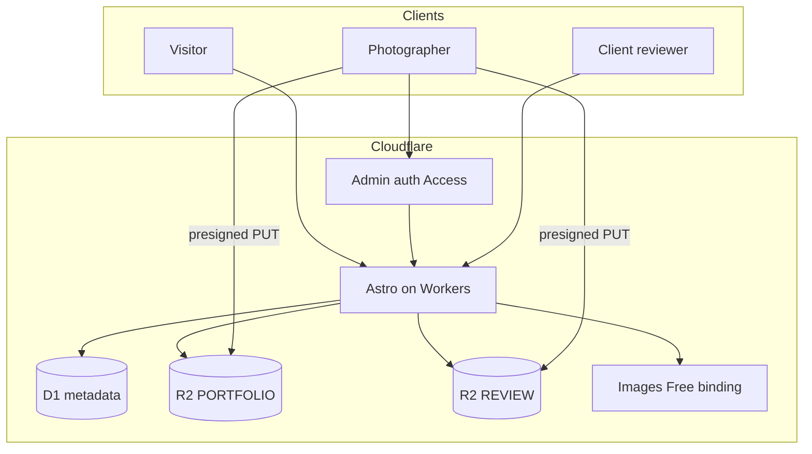
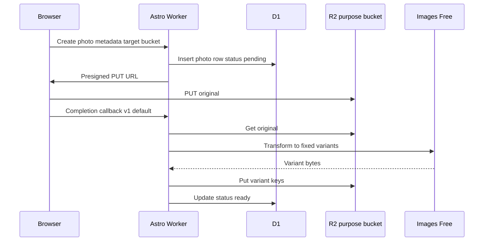

# High-Level Design

## Overview

Rebuild [lawsonphotography.me](https://www.lawsonphotography.me/) on the Cloudflare Developer Platform, replacing the self-hosted LEMP WordPress stack. Public portfolio (hero carousel + filterable galleries), authenticated admin for photo management, and phase-1 client review collections — portfolio and proofing in separate private R2 buckets and separate D1 table domains, app as Astro hybrid SSR on **Workers** (not Pages).

## Goals

- Host the site entirely on Cloudflare (Workers, R2, D1, Images Free)
- Keep photos out of git; manage via admin UI against R2 + D1
- Match the live site’s UX DNA: hero carousel, category filters, lightbox, sticky header/logo, familiar palette cues
- Support client image review (select/approve) without WordPress/Picu
- Isolate proofing from portfolio: separate private R2 buckets **and** separate D1 table domains (Picu-style workflow does not share portfolio photo rows)
- Prefer hobby-friendly cost: Images Free transforms at ingest, not hosted Images storage
- Browser uploads via presigned R2 PUT (Worker does not stream large originals)

## Non-Goals

- Cloudflare **Pages** as the app host (use Workers + Static Assets instead)
- Hosted Cloudflare Images as primary blob storage
- Separate buckets merely for original vs variant (use key prefixes within each purpose bucket)
- tRPC / GraphQL API layer
- Third-party CMS (Payload, Sanity, etc.)
- Password or token gate on client review (phase 1)
- In-app admin login / third-party IdP (Cloudflare Access only)
- Ecommerce / full Picu Pro feature parity
- Estimates, phased task plans, or cutover runbooks (see [IMPLEMENTATION.md](IMPLEMENTATION.md) / [LOE.md](LOE.md) when filled)

## Architecture

Astro (`@astrojs/cloudflare`) hybrid SSR on **Workers** serves public pages, `/admin`, and `/review/*`. Bindings: D1, two R2 buckets (`PORTFOLIO`, `REVIEW`), Images. Config in `wrangler.jsonc`.

Browser **presigned PUT** needs R2 **S3 API credentials** (account secrets, not only `wrangler` R2 bindings) and **CORS** on each upload bucket allowing the admin origin + `PUT`.

**Why Workers, not Pages:** same R2/D1 bindings exist on Pages Functions, but new projects with SSR + bindings + Access fit Workers + Static Assets better (full platform surface, `wrangler.jsonc` as source of truth, Cloudflare’s current default). Media delivery is a Worker route on that same app — not a separate Pages binding.

## Key Components

| Component | Role |
| --- | --- |
| **Public site** | Hero carousel, filterable gallery grid, lightbox; D1 + `/media/portfolio/...` Worker delivery |
| **Admin (`/admin`)** | Manage portfolio and review collections; Cloudflare Access; presigned PUTs into the right bucket; Images ingest after upload |
| **Client review (`/review/{slug}`)** | Picu-style select/approve; phase 1 = link secrecy only (not access control); `noindex` + `robots.txt` Disallow; reads only `REVIEW` bucket via Worker |
| **Drizzle** | Schema source of truth and typed queries against D1 (`drizzle-orm/d1`); flat SQL migrations under `src/db` |
| **Thin handlers under `/admin/api/*`** | Admin mutations (presigned URLs, etc.); not Astro Actions — Actions stay on `/_actions/` and cannot be remounted under `/admin*` |
| **Tailwind + CSS tokens** | Styling; palette/layout inspired by the live Photograph theme |

## Admin auth

**Cloudflare Access** protects admin surfaces at the edge (Free Zero Trust; solo use fits the free seat limit). No in-app login UI or session store.

Access only blocks paths in the Access application. Astro Actions default to `/_actions/<name>` and **cannot** be remounted under `/admin*` — **`/admin*` alone does not protect `/_actions/*`.**

**Required**

1. Mount **all** admin mutations as thin handlers under `/admin/api/*` (not Astro Actions) so **one** Access prefix covers UI + mutations
2. Access policy on `/admin*`
3. Defense in depth: every admin mutation **must** verify the Access JWT (`Cf-Access-Jwt-Assertion`) before touching D1/R2 — even when Access already covers the path

Same-origin admin UI → mutation calls send the Access cookie automatically once those paths are in the Access app. Unauthenticated callers get the Access challenge / deny and do not reach app code.

## Data & Content

### R2 buckets (by purpose)

| Binding | Purpose | Contents |
| --- | --- | --- |
| **`PORTFOLIO`** | Public site gallery / hero | Published (and draft) portfolio originals + variants |
| **`REVIEW`** | Picu-style client proofing | Per-collection uploads + variants; not mixed into portfolio keys |

Both buckets stay **private**. Originals vs variants use key prefixes inside each bucket (e.g. `{id}/original`, `{id}/gallery.webp`) — not a third “delivery” bucket.

Why split portfolio vs review:

- Proofing sets are often unreleased / client-private; wrong URL should not hit portfolio space
- Independent lifecycle (delete a collection without touching the public site)
- Later option: public custom domain only on portfolio if traffic warrants it; review stays Worker-only

### Ingest (same pattern per bucket)

1. Admin asks Worker for a **presigned PUT** into `PORTFOLIO` or `REVIEW`
2. Browser uploads the original, then calls the Worker completion callback (**v1 default**; other triggers `_TBD_`)
3. Worker runs **Images Free** once, then **puts** fixed variant bytes beside the original in R2
4. D1 row marked ready; pages fetch variants via Worker delivery

A photo may move to **failed** and be **reprocessed** from the original; no full status state machine in v1.

**Metadata (D1)** — one database, **two domain boundaries** in Drizzle (exact columns `_TBD_`):

| Domain | Tables (illustrative) | Owns |
| --- | --- | --- |
| **Portfolio** | albums/categories, portfolio photos, publish/hero/sort flags | Public site catalog → `PORTFOLIO` R2 |
| **Review (Picu)** | review collections, review photos, selections/approvals | Proofing workflow → `REVIEW` R2 |

Keep review as its **own table set** (and Drizzle schema module, e.g. `src/db/schema/review/`). Do **not** reuse portfolio photo rows for client collections — no shared “photos” table across domains. Foreign keys stay inside a domain; promoting a selected review image into the portfolio is an explicit copy/import, not a join across domains.

**One D1 binding** is enough for a hobby site (one migration stream, one `drizzle()`). A second D1 database is optional later if you want hard backup/isolation; not required while the table boundary is clean. Not KV.

**Media ingest**

### Delivery URL strategy

**Decision:** Worker-mediated delivery for both buckets, allowlisted variant suffixes only, long `Cache-Control` / CDN cache.

On review object delete: purge CDN for affected `/media/review/...` keys, **or** use a shorter TTL on that route than portfolio (cache hygiene, not auth).

| Route (illustrative) | Bucket |
| --- | --- |
| `/media/portfolio/{id}/{variant}` | `PORTFOLIO` |
| `/media/review/{id}/{variant}` | `REVIEW` |

Do not use a public R2 custom domain for review. Portfolio may revisit a public custom domain later if QPS warrants it; not required for v1.

| Strategy | Role here |
| --- | --- |
| **Worker route + cache** | **Chosen** for portfolio and review |
| R2 public custom domain | Deferred optional for portfolio only |
| Presigned GET | Not for portfolio grid; unnecessary if Worker routes exist |

## Open Questions

- Exact column-level D1 schema within portfolio vs review domains — `_TBD_`
- Post-upload trigger alternatives (R2 event notification, admin “process” action) — `_TBD_`; **v1 default:** browser completion callback after successful PUT
- Whether review ever needs its own D1 database (default: no — table boundary only) — `_TBD_` only if isolation requirements change
