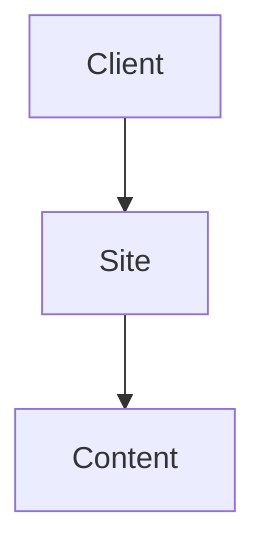
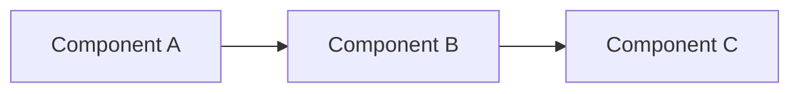

# High-Level Design

## Overview

_TBD_

## Goals

_TBD_

## Non-Goals

_TBD_

## Architecture

_TBD_

```mermaid
flowchart TB
  %% TBD: replace placeholders with real components
  Client["Client"]
  Site["Site"]
  Content["Content"]

  Client --> Site
  Site --> Content
```

## Key Components

_TBD_

```mermaid
flowchart LR
  %% TBD: component relationships
  A["Component A"]
  B["Component B"]
  C["Component C"]

  A --> B
  B --> C
```

## Data & Content

_TBD_

## Open Questions

_TBD_
