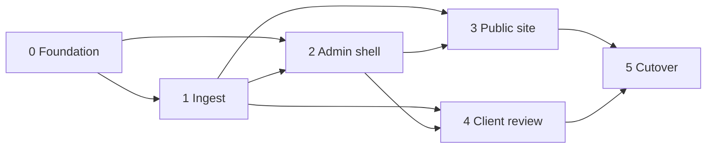

# Implementation

Lean build plan for the Lawson Photography rebuild. Architecture, bindings, and security decisions live in [HLD.md](HLD.md) — this doc sequences work only. Schedule and estimates: [PROGRESS.md](PROGRESS.md), [LOE.md](LOE.md).

## Scope

Sequence the rebuild described in [HLD.md](HLD.md): foundation → ingest → admin → public portfolio → phase-1 client review → cutover.

Out of scope for this plan: LOE numbers, scaffolding/code, and product details still marked `_TBD_` in HLD (exact D1 columns, variant set, public IA polish, cutover source).

## Do not reopen — see HLD

Stack and product decisions are owned by [HLD.md](HLD.md). Do not mirror them here.

Point at HLD for locked decisions:

- [Architecture](HLD.md#architecture) — Astro hybrid SSR on Workers, bindings, R2 S3 credentials/CORS for presigned PUT
- [Key Components](HLD.md#key-components) — public site, admin, client review, Drizzle, `/admin/api/*` handlers, Tailwind tokens
- [Admin auth](HLD.md#admin-auth) — Access on `/admin*`; mutations under `/admin/*` + JWT verify
- [Data & Content](HLD.md#data--content) — `PORTFOLIO`/`REVIEW` buckets, ingest sequence, D1 domain split, Worker delivery routes

**Plan-only sequencing rules** (not architecture restatement):

- Every admin mutation stays under `/admin/*` and verifies the Access JWT (shapes Phase 0–2 task boundaries).
- Phase-4 review stays link-secrecy only; a password gate is deferred (shapes Phase 4 scope).

## Phases

One composition of work; later phases depend on earlier foundations. Schedule stays in [PROGRESS.md](PROGRESS.md).

### Phase 0 — Foundation

Stand up the Workers + Astro hybrid app, wrangler bindings, D1 schema skeleton (separate portfolio/review domains), R2 bucket bindings, Tailwind/CSS tokens, and Access wiring for `/admin*`. No feature UI beyond a health/smoke path.

**Tasks**

- [ ] Astro hybrid SSR project + `wrangler.jsonc` Workers deploy path
- [ ] D1 database + Drizzle; flat migration layout under `src/db`; empty portfolio vs review schema modules (no shared photos table)
- [ ] Bind private R2 buckets `PORTFOLIO` and `REVIEW`
- [ ] Configure R2 S3 API credentials/secrets and CORS for browser PUT (needed by Phase 1)
- [ ] Tailwind + CSS design tokens (stub values OK; brand polish `_TBD_`)
- [ ] Place all admin mutations under `/admin/api/*` (thin handlers; not Astro Actions — see [HLD Admin auth](HLD.md#admin-auth)) so one Access prefix covers UI + mutations
- [ ] Cloudflare Access on `/admin*`; shared Access JWT verification helper for all `/admin/*` handlers
- [ ] Env/secrets inventory for local + prod (`_TBD_` list — document as decided)

### Phase 1 — Ingest

Original upload via browser presigned PUT, compress-once via Images Free, Worker persists variant bytes under key prefixes, and D1 rows record assets for the target purpose bucket.

**Tasks**

- [x] Admin-only endpoints under `/admin/*` to mint presigned PUT URLs into `PORTFOLIO` or `REVIEW` (JWT verified)
- [x] Browser upload client: PUT to R2, then completion callback to Worker (v1 default per HLD)
- [x] Ingest completion handler: Images Free compress-once → Worker puts variant bytes beside original under key prefixes
- [x] D1 writes for portfolio domain metadata (ids, status, pending/ready/failed) — exact columns `_TBD_` in HLD *(DAO schema: cuid2 `id` / `status` / `mimeType` / timestamps; R2 keys derived from `id`; review photos same + `collectionId`)*
- [x] Reprocess path from original for failed photos (no full status state machine in v1)
- [ ] Failure/retry behavior for incomplete PUT or compress failures (details `_TBD_`) — *minimal: log + mark `failed` + reprocess*

### Phase 2 — Admin

Access-gated admin UI and mutations for managing portfolio and (as review lands) review collections. Every mutating route stays under `/admin/*` with JWT verify.

**Tasks**

- [ ] Admin shell/layout behind Access
- [ ] Portfolio CRUD/list/publish/hero/sort flows (exact fields `_TBD_`)
- [ ] Trigger/monitor ingest from admin (including reprocess)
- [ ] Review-collection management (create/list/revoke links; attach uploads to `REVIEW`) — usable once Phase 4 media path exists
- [ ] Confirm no admin mutations exist outside `/admin/*`

### Phase 3 — Public site

Public portfolio pages served from Astro/Workers, reading portfolio D1 + delivering images from private `PORTFOLIO` via Worker media routes (see [HLD delivery](HLD.md#delivery-url-strategy)).

**Tasks**

- [ ] Public routes matching live UX DNA (hero carousel, filterable galleries, lightbox); exact page inventory `_TBD_`
- [ ] Portfolio queries (published-only) from D1 portfolio domain
- [ ] Worker route `/media/portfolio/{id}/{variant}` — allowlisted variant suffixes only; long `Cache-Control` / CDN cache
- [ ] SEO basics for public pages; ensure review URLs stay out of public indexes (see Phase 4)
- [ ] Responsive layout using tokens from Phase 0

### Phase 4 — Client review (phase 1)

Shareable review links protected by secrecy only. Media via Worker `/media/review/...`. No password gate in v1; design so one can be added later.

**Tasks**

- [ ] Review Drizzle module/tables: collections, review photos, selections/approvals (exact columns `_TBD_` in HLD)
- [ ] Create/revoke review links from admin (`/admin/*`)
- [ ] Public review page(s) at `/review/{slug}` — link secrecy only; select/approve UX wired to review-domain mutations
- [ ] Worker route `/media/review/{id}/{variant}` serving from `REVIEW` bucket (allowlisted variants)
- [ ] `noindex` meta + `robots.txt` Disallow for review surfaces
- [ ] On review object delete: purge CDN for affected `/media/review/...` keys and/or shorter TTL than portfolio
- [ ] Document extension point for a future password gate (no implementation in v1)

### Phase 5 — Cutover

Move traffic/content from the current site to the new Workers deployment. Exact cutover runbook `_TBD_`.

**Tasks**

- [ ] Content/asset migration plan from legacy source (`_TBD_`)
- [ ] DNS / custom domain / Access production checklist (`_TBD_`)
- [ ] Smoke tests: public portfolio, admin Access, upload→ingest→variants, review link + media + purge
- [ ] Rollback notes (`_TBD_`)

## Dependencies

| Depends on | For |
| --- | --- |
| Remaining HLD `_TBD_`s (columns, variant set, IA polish, cutover) | Tighten later phases — **not** required to start Phase 0 scaffold |
| R2 S3 API secrets + CORS | Browser presigned PUT |
| Cloudflare Access application for `/admin*` | Admin shell and all mutations |
| Images Free (compress) entitlement | Ingest pipeline |
| [LOE.md](LOE.md) | Effort — **do not invent numbers here** |

## Risks

| Risk | Mitigation direction |
| --- | --- |
| Presigned PUT CORS / credential misconfig | Prove upload smoke in Phase 0/1 before admin UI polish |
| Accidental public exposure of review media | Private `REVIEW` bucket; Worker-only delivery; `noindex`; purge/TTL |
| Admin mutation reachable without Access JWT | Mount under `/admin/*`; verify JWT on every mutation; deny by default |
| Scope creep into passworded review, hosted Images storage, or extra buckets | Explicitly deferred in HLD; phase-1 link secrecy only |
| Column/IA `_TBD_` churn after scaffold | Keep Phase 0 schema as empty domain modules; refine columns before Phase 1–3 polish |

## Open questions

Answered in HLD (do not reopen here): stack host (Workers), bucket split, Worker delivery routes (`/media/portfolio/...`, `/media/review/...`), Access+JWT admin model, ingest v1 completion callback, Images Free compress-once, no tRPC / no hosted Images storage, phase-1 link-secrecy review.

Still need Chris / HLD before *tightening* later phases (scaffold can proceed with stubs):

1. **Exact D1 columns** within portfolio vs review domains — `_TBD_` in HLD
2. **Public IA & portfolio model** — Which pages/sections ship in v1? Album vs single-image vs mixed?
3. **Ingest variant set** — Which widths/formats after Images Free compress-once?
4. **Post-upload trigger alternatives** — R2 event notification or admin “process” action vs v1 browser callback (`_TBD_` alternatives only)
5. **Review TTL default** — Duration; purge-on-delete vs expiry-only (HLD requires purge and/or shorter TTL hygiene)
6. **Legacy cutover source** — Where do existing assets/content live today?
7. **Brand / visual direction** — Token values and type choices (Phase 0 can stub tokens first)
8. **Second D1 database** — Only if isolation requirements change (HLD default: one D1, table boundary only)

Resolve in HLD (or explicitly defer); do not invent answers in this file.
