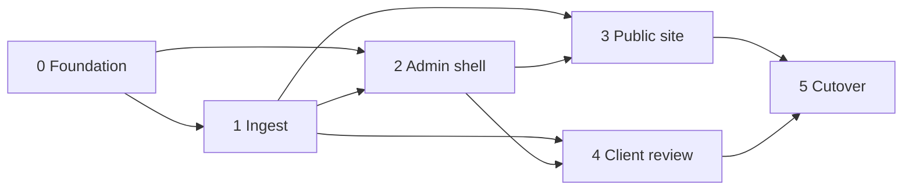

# Implementation

Lean build plan for the Lawson Photography rebuild. Architecture, bindings, and security decisions live in [HLD.md](HLD.md) — this doc sequences work only. Schedule and estimates: [PROGRESS.md](PROGRESS.md), [LOE.md](LOE.md).

## Scope

Sequence the rebuild described in [HLD.md](HLD.md): foundation → ingest → admin → public portfolio → phase-1 client review → cutover.

Out of scope for this plan: LOE numbers, scaffolding/code, and product copy/IA details still marked `_TBD_` in HLD.

## Do not reopen — see HLD

Stack and product decisions are owned by [HLD.md](HLD.md). Do not mirror them here.

Point at the closest stable HLD headings (bodies still `_TBD_`; finer § anchors wait on HLD structure):

- [Architecture](HLD.md#architecture)
- [Key Components](HLD.md#key-components)
- [Data & Content](HLD.md#data--content)

**Plan-only sequencing rules** (not architecture):

- Every admin mutation stays under `/admin/*` and verifies the Access JWT (shapes Phase 0–2 task boundaries).
- Phase-4 review stays link-secrecy only; a password gate is deferred (shapes Phase 4 scope, not HLD restatement).

## Phases

One composition of work; later phases depend on earlier foundations. Schedule stays in [PROGRESS.md](PROGRESS.md).

### Phase 0 — Foundation

Stand up the Workers + Astro hybrid app, wrangler bindings, D1 schema skeleton (separate portfolio/review domains), R2 bucket bindings, Tailwind/CSS tokens, and Access wiring for `/admin*`. No feature UI beyond a health/smoke path.

**Tasks**

- [ ] Astro hybrid SSR project + `wrangler.jsonc` Workers deploy path
- [ ] D1 database + Drizzle; flat migration layout; empty portfolio vs review table domains
- [ ] Bind private R2 buckets `PORTFOLIO` and `REVIEW`
- [ ] Configure R2 S3 API credentials/secrets and CORS for browser PUT (needed by Phase 1)
- [ ] Tailwind + CSS design tokens (visual system details `_TBD_` pending HLD/brand)
- [ ] Cloudflare Access on `/admin*`; shared Access JWT verification helper for all `/admin/*` handlers
- [ ] Env/secrets inventory documented once decided (`_TBD_` in HLD)

### Phase 1 — Ingest

Original upload via browser presigned PUT, compress-once via Images Free, Worker persists variant bytes under key prefixes, and D1 rows record portfolio (and later review) assets.

**Tasks**

- [ ] Admin-only endpoints under `/admin/*` to mint presigned PUT URLs (JWT verified)
- [ ] Browser upload client: PUT to R2, then callback to complete ingest
- [ ] Ingest completion handler: Images Free compress-once → Worker puts variant bytes to the correct bucket/prefix
- [ ] D1 writes for portfolio domain metadata (ids, keys, variants, status) — exact columns `_TBD_` in HLD
- [ ] Failure/retry behavior for incomplete PUT or compress failures (`_TBD_`)

### Phase 2 — Admin

Access-gated admin UI and mutations for managing portfolio and (as review lands) review galleries. Every mutating route stays under `/admin/*` with JWT verify.

**Tasks**

- [ ] Admin shell/layout behind Access
- [ ] Portfolio CRUD/list/publish flows (fields and workflows `_TBD_`)
- [ ] Trigger/monitor ingest from admin
- [ ] Review-session management hooks (create/list/revoke) — usable once Phase 4 media path exists
- [ ] Confirm no admin mutations exist outside `/admin/*`

### Phase 3 — Public site

Public portfolio pages served from Astro/Workers, reading portfolio D1 + delivering images from `PORTFOLIO` (private bucket; delivery mechanism per HLD).

**Tasks**

- [ ] Public routes/IA (`_TBD_` page inventory in HLD)
- [ ] Portfolio queries (published-only) from D1 portfolio domain
- [ ] Image delivery for public portfolio (Worker media path or equivalent — `_TBD_` in HLD; must not use hosted Images storage)
- [ ] SEO basics for public pages; ensure review URLs stay out of public indexes (see Phase 4)
- [ ] Responsive layout using tokens from Phase 0

### Phase 4 — Client review (phase 1)

Shareable review links protected by secrecy only. Media via Worker `/media/review/...`. No password gate in v1; design so one can be added later.

**Tasks**

- [ ] Review table domain: sessions/assets/expiry (schema details `_TBD_` in HLD)
- [ ] Create/revoke review links from admin (`/admin/*`)
- [ ] Public review page(s) reachable only via secret link
- [ ] Worker route `/media/review/...` serving from `REVIEW` bucket
- [ ] `noindex` meta + robots rules for review surfaces
- [ ] Shorter TTL and/or purge objects + rows on delete
- [ ] Document extension point for a future password gate (no implementation in v1)

### Phase 5 — Cutover

Move traffic/content from the current site to the new Workers deployment. Exact cutover runbook `_TBD_`.

**Tasks**

- [ ] Content/asset migration plan from legacy source (`_TBD_`)
- [ ] DNS / custom domain / Access production checklist (`_TBD_`)
- [ ] Smoke tests: public portfolio, admin Access, upload→ingest→variants, review link + media + purge
- [ ] Rollback notes (`_TBD_`)

## Dependencies

| Depends on | For |
| --- | --- |
| [HLD.md](HLD.md) filled beyond stubs | Schema columns, public IA, media delivery shape, brand/tokens, cutover source |
| R2 S3 API secrets + CORS | Browser presigned PUT |
| Cloudflare Access application for `/admin*` | Admin shell and all mutations |
| Images Free (compress) entitlement | Ingest pipeline |
| [LOE.md](LOE.md) | Effort — **do not invent numbers here** |

## Risks

| Risk | Mitigation direction |
| --- | --- |
| HLD still stubbed — plan may need re-chunking | Keep tasks coarse; refine after HLD approval |
| Presigned PUT CORS / credential misconfig | Prove upload smoke in Phase 0/1 before admin UI polish |
| Accidental public exposure of review media | Private `REVIEW` bucket; Worker gate; `noindex`; purge/TTL |
| Admin mutation reachable without Access JWT | Enforce verify on every `/admin/*` mutation; deny by default |
| Scope creep into passworded review or extra buckets | Explicitly deferred; phase-1 link secrecy only |

## Open questions

Need Chris / HLD before scaffolding:

1. **HLD completion** — [Architecture](HLD.md#architecture), [Key Components](HLD.md#key-components), and [Data & Content](HLD.md#data--content) are still `_TBD_`. Fill those before scaffolding; finer IMPLEMENTATION pointers depend on named HLD subsections.
2. **Public IA & portfolio model** — Which pages/sections ship in v1? Album vs single-image vs mixed?
3. **Public media delivery** — Exact Worker path/caching for portfolio images (review path is `/media/review/...`).
4. **Ingest variant set** — Which widths/formats after Images Free compress-once?
5. **Review TTL default** — Duration, and purge-on-delete vs expiry-only.
6. **Legacy cutover source** — Where do existing assets/content live today?
7. **Brand / visual direction** — Token values and type choices (needed for Phase 0 UI polish; can stub tokens first).

Items above should be resolved in HLD (or explicitly deferred), not invented in this file.
