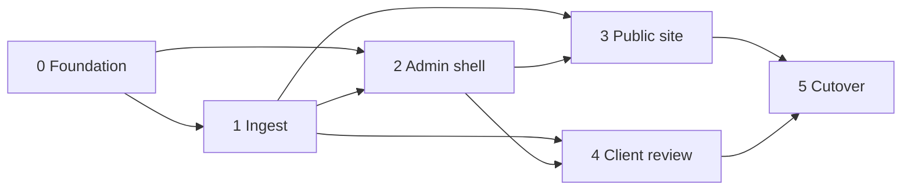

# Implementation

Lean build plan for the Lawson Photography rebuild. Architecture, bindings, and security decisions live in [HLD.md](HLD.md) — this doc sequences work only. Admin workflows and interaction patterns: [ADMIN-UX.md](ADMIN-UX.md). Schedule and estimates: [PROGRESS.md](PROGRESS.md), [LOE.md](LOE.md).

## Scope

Sequence the rebuild described in [HLD.md](HLD.md): foundation → ingest → admin → public portfolio → phase-1 client review → cutover.

Out of scope for this plan: LOE numbers, scaffolding/code, and product details still marked `_TBD_` in HLD (exact D1 columns, variant set, public IA polish, cutover source).

## Do not reopen — see HLD / ADMIN-UX

Stack and product decisions are owned by [HLD.md](HLD.md). Admin workflows and IA are owned by [ADMIN-UX.md](ADMIN-UX.md). Do not mirror them here.

Point at HLD for locked decisions:

- [Architecture](HLD.md#architecture) — Astro hybrid SSR on Workers, bindings, R2 S3 credentials/CORS for presigned PUT
- [Key Components](HLD.md#key-components) — public site, admin, client review, Drizzle, `/admin/api/trpc`, Tailwind tokens
- [Admin auth](HLD.md#admin-auth) — Access on `/admin*`; mutations under `/admin/*` + JWT verify
- [Data & Content](HLD.md#data--content) — `PORTFOLIO`/`REVIEW` buckets, ingest sequence, D1 domain split, Worker delivery routes

Point at ADMIN-UX for Phase 2.6 product decisions (job steps, delivery round, front-page set, patterns).

**Plan-only sequencing rules** (not architecture restatement):

- Every admin mutation stays under `/admin/*` and verifies the Access JWT (shapes Phase 0–2 task boundaries).
- Phase-4 review stays link-secrecy only; a password gate is deferred (shapes Phase 4 scope).

## Phases

One composition of work; later phases depend on earlier foundations. Schedule stays in [PROGRESS.md](PROGRESS.md).

### Phase 0 — Foundation

Stand up the Workers + Astro hybrid app, wrangler bindings, D1 schema skeleton (separate portfolio/review domains), R2 bucket bindings, Tailwind/CSS tokens, and Access wiring for `/admin*`. No feature UI beyond a health/smoke path.

**Tasks**

- [x] Astro hybrid SSR project + `wrangler.jsonc` Workers deploy path ([PR #3](https://github.com/cjlawson02/photography/pull/3))
- [x] D1 database + Drizzle; flat migration layout under `src/db`; portfolio vs review schema modules (no shared photos table) ([PR #6](https://github.com/cjlawson02/photography/pull/6))
- [x] Bind private R2 buckets `PORTFOLIO` and `REVIEW`
- [x] Configure R2 S3 API credentials/secrets and CORS for browser PUT — inventory + CORS IaC in repo; production apply per [DEPLOY.md](DEPLOY.md)
- [x] Tailwind + CSS design tokens (stub/reference values; brand polish `_TBD_` — [PR #9](https://github.com/cjlawson02/photography/pull/9))
- [x] Admin mutations via **`/admin/api/trpc`** (+ **`/admin/api/health`** smoke); not Astro Actions — see [HLD Admin auth](HLD.md#admin-auth) so one Access prefix covers UI + mutations
- [x] Shared Access JWT verification helper for all `/admin/*` handlers; Zero Trust app on `/admin*` — create per [DEPLOY.md](DEPLOY.md)
- [x] Env/secrets inventory for local + prod (`.dev.vars.example`, [DEPLOY.md](DEPLOY.md))

### Phase 1 — Ingest

Original upload via browser presigned PUT, compress-once via Images Free, Worker persists variant bytes under key prefixes, and D1 rows record assets for the target purpose bucket.

**Tasks**

- [x] Admin-only endpoints under `/admin/*` to mint presigned PUT URLs into `PORTFOLIO` or `REVIEW` (JWT verified)
- [x] Browser upload client: PUT to R2, then completion callback to Worker (v1 default per HLD)
- [x] Ingest completion handler: Images Free compress-once → Worker puts variant bytes beside original under key prefixes
- [x] D1 writes for portfolio domain metadata (ids, status, pending/ready/failed) — exact columns `_TBD_` in HLD *(DAO schema: cuid2 `id` / `status` / `mimeType` / timestamps; R2 keys derived from `id`; review photos same + `collectionId`)*
- [x] Reprocess path from original for failed photos (no full status state machine in v1)
- [x] Failure/retry behavior for incomplete PUT or compress failures — log + mark `failed`; reprocess API + portfolio admin **Reprocess** for `pending`/`failed`

### Phase 2 — Admin

Access-gated admin UI and mutations for managing portfolio and (as review lands) review collections. Every mutating route stays under `/admin/*` with JWT verify.

**Tasks**

- [x] Admin shell/layout behind Access ([PR #8](https://github.com/cjlawson02/photography/pull/8))
- [x] Portfolio CRUD/list/publish/hero/sort flows — `/admin/portfolio` + tRPC `portfolio.*`
- [x] Trigger/monitor ingest from admin — inline upload on portfolio + review collection detail (`AdminPhotoUpload`); `/admin/ingest` redirects to portfolio; reprocess on portfolio admin for failed rows
- [x] Review-collection management (create/list/revoke; attach uploads via ingest `collectionId`) — API + admin UI ([PR #8](https://github.com/cjlawson02/photography/pull/8)); revoke in Phase 4; list row **Upload** → detail `#upload`
- [x] Confirm no admin mutations exist outside `/admin/*`

### Phase 3 — Public site

Public portfolio pages served from Astro/Workers, reading portfolio D1 + delivering images from private `PORTFOLIO` via Worker media routes (see [HLD delivery](HLD.md#delivery-url-strategy)).

**Tasks**

- [x] Public home hero carousel (Embla + autoplay) + masonry gallery + PhotoSwipe lightbox (`gallery.webp`; published/ready D1, `/media/portfolio` variants) — [PR #13](https://github.com/cjlawson02/photography/pull/13)
- [ ] Public routes matching live UX DNA beyond home; exact page inventory `_TBD_`
- [x] Public home shell: `PublicLayout`, header/footer, placeholder hero + gallery grid, static category filter chips ([PR #10](https://github.com/cjlawson02/photography/pull/10))
- [x] Portfolio queries (published-only) from D1 portfolio domain — `listPublishedPortfolioPhotos` on home
- [x] Worker route `/media/portfolio/{id}/{variant}` — allowlisted variant suffixes only; long `Cache-Control` / CDN cache ([PR #10](https://github.com/cjlawson02/photography/pull/10))
- [x] SEO basics for public portfolio pages — home meta description, canonical, Open Graph (`src/lib/site/public-meta.ts`); review `noindex` in Phase 4
- [x] Responsive layout using tokens from Phase 0 (public shell slice — [PR #10](https://github.com/cjlawson02/photography/pull/10))

### Phase 4 — Client review (phase 1)

Shareable review links protected by secrecy only. Media via Worker `/media/review/...`. No password gate in v1; design so one can be added later.

**Tasks**

- [x] Review Drizzle module/tables: collections, review photos, `selectionStatus` (Phase 2 / [PR #6](https://github.com/cjlawson02/photography/pull/6))
- [x] Create/revoke review links from admin (tRPC `review.collections.create` / `review.collections.revoke`)
- [x] Public review page at `/review/{slug}` — link secrecy only; select/approve via `POST /review/api/selection`
- [x] Worker route `/media/review/{id}/{variant}` serving from `REVIEW` bucket (allowlisted variants)
- [x] `noindex` meta + `robots.txt` Disallow for review surfaces
- [x] On review revoke: optional R2 cleanup + shorter `/media/review` cache TTL than portfolio
- [x] Extension point for future password gate — `resolveReviewCollectionAccess` in `src/lib/review/collection-access.ts`
- [x] Inline review upload on collection detail (`#upload`); list **Upload** links to detail anchor

### Phase 5 — Cutover

Move traffic/content from the current site to the new Workers deployment. Runbook: [CUTOVER.md](CUTOVER.md).

**Tasks**

- [x] Content/asset migration — **portfolio** (**T7**) — **done** (Chris, 2026-09-26); legacy Picu/review _TBD_ — [CUTOVER.md#content-and-asset-migration-t7](CUTOVER.md#content-and-asset-migration-t7)
- [x] DNS / custom domain — `photography.chrislawson.dev` live; legacy **301** on `lawsonphotography.me` ([CUTOVER.md#dns-and-domain](CUTOVER.md#dns-and-domain))
- [ ] Access production re-verify after DNS changes — [DEPLOY.md](DEPLOY.md#2-cloudflare-access-admin)
- [x] Smoke tests checklist — [SMOKE.md](SMOKE.md) (manual; automation `_TBD_`)
- [ ] Rollback notes — draft table in [CUTOVER.md#rollback](CUTOVER.md#rollback); RTO/RPO _TBD_
- [ ] Remote D1 migrate + deploy promote + production smoke (**T6**) — **after T7** — [CUTOVER.md#cutover-sequence-after-migration](CUTOVER.md#cutover-sequence-after-migration)

### Phase 2.5 — Post-MVP backlog

Hardening and polish after MVP ([#21](https://github.com/cjlawson02/photography/pull/21)–[#23](https://github.com/cjlawson02/photography/pull/23)). Most rows are **done**; open work is explicit.

| ID | Item | Notes |
| --- | --- | --- |
| B3 | Admin review selections + photos view | **Done** — `review.collections.detail`, `ReviewCollectionDetailAdmin` ([#26](https://github.com/cjlawson02/photography/pull/26)) |
| S1 | Review slug hardening | **Done** — server-generated slugs + optional prefix ([#27](https://github.com/cjlawson02/photography/pull/27)) |
| S2 | Rate-limit `/review/api/selection` | **Done** — `REVIEW_SELECTION_RATE_LIMITER`; hashed IP; `ADMIN_TRPC_RATE_LIMITER` on `ingest.*` ([#27](https://github.com/cjlawson02/photography/pull/27)) |
| S4 | Delete / revoke ordering | **Done** — R2 batch delete; R2-before-D1 ([#30](https://github.com/cjlawson02/photography/pull/30)) |
| S6 | Security headers | **Done** — middleware + CSP (Astro inline + Cloudflare beacon) ([#25](https://github.com/cjlawson02/photography/pull/25), [#43](https://github.com/cjlawson02/photography/pull/43)) |
| P1 | Ingest dimensions | **Done** — ingest + public galleries ([#31](https://github.com/cjlawson02/photography/pull/31), [#34](https://github.com/cjlawson02/photography/pull/34)) |
| P2 | Portfolio alt / title / caption | **Done** — migration `0004_*` ([#36](https://github.com/cjlawson02/photography/pull/36)); public PhotoSwipe caption UI (`public-lightbox-caption`, title when distinct from alt) |
| P3 | Admin empty states | **Done** ([#39](https://github.com/cjlawson02/photography/pull/39)) |
| P4 | Upload UX | **Done** — progress bar ([#40](https://github.com/cjlawson02/photography/pull/40)); inline upload ([#45](https://github.com/cjlawson02/photography/pull/45)) |
| P5 | Review lifecycle | **Done (partial)** — collection update ([#41](https://github.com/cjlawson02/photography/pull/41)); delete review photo ([#42](https://github.com/cjlawson02/photography/pull/42)) |
| P6 | Stale pending ingest | **Done** — lazy cleanup on admin lists; no Cron ([#44](https://github.com/cjlawson02/photography/pull/44), [#45](https://github.com/cjlawson02/photography/pull/45)) |
| P7 | Admin pagination | **Done (partial)** — `portfolio.list` cursor ([#38](https://github.com/cjlawson02/photography/pull/38)) |
| P8 | Portfolio priority / rating | _Open_ — per-photo priority flag (or rating) editable in admin; public mosaic (`src/lib/gallery/mosaic-layout.ts`) favors high-priority photos for large slots (full-height beside a stack, wider singles). Scale (boolean vs 1–5) _TBD_ |
| P9 | Multiple tags per photo | _Open_ — `PortfolioPhotos.category` is a single nullable column today; move to a many-to-many tag table (or JSON array) so one photo can appear under several filters. Admin multi-select + public filter/counts update; migration backfills from `category` |
| M1 | Admin Query islands | **Done** — TanStack + tRPC on portfolio/review |
| M2 | Dead admin fetch helpers | **Done** ([#29](https://github.com/cjlawson02/photography/pull/29)) |
| M3–M4 | UI primitives / Embla | **M3 Done** ([#46](https://github.com/cjlawson02/photography/pull/46)) — `admin-styles`, `admin-format`, table/status/form primitives + `AdminPhotoUpload`. **M4 N/A** — imperative `embla-carousel` per [FRONTEND.md](FRONTEND.md). |
| M6 | Admin SSR initial reads | **Done** — [FRONTEND.md § Hydration choices](FRONTEND.md#hydration-choices). _Deferred (low):_ portfolio `stalePendingOnly` toggle may re-apply SSR seed (FIX-04) |
| M5 | Admin forms | **Done** — portfolio/review admin forms use [react-hook-form](https://react-hook-form.com/) + `@hookform/resolvers/zod`; shared client schemas in `src/lib/admin/admin-form-schemas.ts` (reuses `review-collection-schemas` / DB category types) |
| T1 | Test suite | **Partial** ([#33](https://github.com/cjlawson02/photography/pull/33), [#47](https://github.com/cjlawson02/photography/pull/47), [#52](https://github.com/cjlawson02/photography/pull/52)). Vitest RTL + `vitest.server.config`; admin `/admin*` JWT gate + `/admin/api/media/review` handler tests; bulk `node:test` → `*.server.vitest.ts` (review selection/rate-limit). _Open:_ five remaining `node:test` files + workerd pool (audit FIX-28). **RTL:** prefer `@testing-library/user-event` over `fireEvent` (almost always) |
| T4 | D1 migrations in CI | **Done** — deploy applies remote on `main` ([#28](https://github.com/cjlawson02/photography/pull/28)); PR **`npm run db:migrate:check`** local apply + drift gate ([DEPLOY.md](DEPLOY.md#6-github-actions-cicd)) |
| S7 | Security / reliability audit | **Done (shipped)** ([#51](https://github.com/cjlawson02/photography/pull/51), [#52](https://github.com/cjlawson02/photography/pull/52)) — 11/11 findings addressed; re-review **conditional pass** (non-blocking gaps → **S9**, **T1**). |
| S9 | Ingest re-review follow-up | **Done** — orphaned R2 cleanup on failed `markReady`; `updateIfStatus` for concurrent `complete`; `markFailed` no longer masks errors; `ingest-service.server.vitest.ts`; presign TTL single source; admin review media `Cache-Control: private`; explicit MIME reject in `browser-upload`; removed dead `listPublishedForPublic`. |
| S8 | Security polish (deferred) | _Open_ — CSP nonces vs `'unsafe-inline'` (FIX-10); EU Sentry ingest host in `connect-src` if DSN is EU (`*.ingest.de.sentry.io`); ingest presigned PUT + CORS E2E (FIX-11); trim `/health` binding detail if abused (FIX-09) |
| R1 | Review audit — triage leads | _Open_ — unverified leads FIX-31–40 (e.g. `ReviewGallery` JSON before `ok`, selection UX, lightbox dimensions); fix when reproduced |
| R2 | Review audit — product / ops | _Track_ — optional reviewer password gate (FIX-06); confirm zone HSTS + Access coverage (Q-01); review proof cache TTL after revoke (Q-02) |
| T5 | Indexes | **Done** ([#25](https://github.com/cjlawson02/photography/pull/25)) |
| T6–T7 | Cutover + bulk migration | **In progress** — portfolio **T7 done**; **T6** [cutover sequence](CUTOVER.md#cutover-sequence-after-migration) next; domain + legacy 301 live |
| O1 | Sentry | **Done** — Worker + admin browser + CI source maps; setup and env: [DEPLOY.md § Sentry](DEPLOY.md#3a-sentry-optional-worker-errors) |

### Phase 2.6 — Admin UX v2

Guided, low-frequency admin: client-shoot step rail (proof → picks → deliver finals) and front-page curation. **Canonical product/UX:** [ADMIN-UX.md](ADMIN-UX.md). Do not restate workflows here — task IDs point at that doc. Estimates: [LOE.md](LOE.md) (`_TBD_` until sized).

**Tasks** (planned)

- [x] **A1** Shoot job page + step rail — [ADMIN-UX § Lifecycles / Workflows 1–2](ADMIN-UX.md#lifecycles)
- [x] **A2** Client “Submit picks” + lock / reopen + filename export for Lightroom — [Workflow 2](ADMIN-UX.md#2-receive-picks); persist `originalFilename`
- [x] **A3** Delivery round + public download mode — [Workflow 3](ADMIN-UX.md#3-deliver-finals) (ZIP / storage shape: [open decisions](ADMIN-UX.md#open-decisions))
- [x] **A4** Front-page set (order, hero) + Library grid + inspector — [Workflow 5](ADMIN-UX.md#5-refresh-the-front-page); [patterns](ADMIN-UX.md#interaction-patterns)
- [x] **A5** Home (active shoot cards + attention banners) — [IA](ADMIN-UX.md#information-architecture)
- [x] **A6** Close-out, retention, promote-to-portfolio — [Workflow 4](ADMIN-UX.md#4-close-out); HLD promote-as-copy
- [ ] **A7** Ingest recovery parity (retry/remove) on proofs and finals — [Workflow 6](ADMIN-UX.md#6-recover-failed--stale-ingest)
- [ ] Forms on new surfaces: react-hook-form + zod (same as M5 / [FRONTEND.md](FRONTEND.md))

## Dependencies

| Depends on | For |
| --- | --- |
| Remaining HLD `_TBD_`s (columns, variant set, IA polish, cutover) | Tighten later phases — **not** required to start Phase 0 scaffold |
| R2 S3 API secrets + CORS | Browser presigned PUT |
| Cloudflare Access application for `/admin*` | Admin shell and all mutations |
| Images Free (compress) entitlement | Ingest pipeline |
| [LOE.md](LOE.md) | Effort — **do not invent numbers here** |

## Risks

| Risk | Mitigation direction |
| --- | --- |
| Presigned PUT CORS / credential misconfig | Prove upload smoke in Phase 0/1 before admin UI polish |
| Accidental public exposure of review media | Private `REVIEW` bucket; Worker-only delivery; `noindex`; purge/TTL |
| Admin mutation reachable without Access JWT | Mount under `/admin/*`; verify JWT on every mutation; deny by default |
| Scope creep into passworded review, hosted Images storage, or extra buckets | Explicitly deferred in HLD; phase-1 link secrecy only |
| Column/IA `_TBD_` churn after scaffold | Keep Phase 0 schema as empty domain modules; refine columns before Phase 1–3 polish |

## Open questions

Canonical list: [HLD.md § Open Questions](HLD.md#open-questions). Resolve or defer there; do not invent answers in this file.
