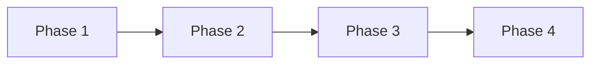
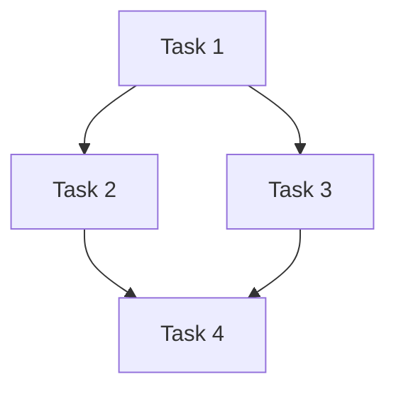

# Implementation

## Scope

_TBD_

## Phases

_TBD_

```mermaid
flowchart LR
  %% TBD: replace with real phases
  P1["Phase 1"] --> P2["Phase 2"] --> P3["Phase 3"] --> P4["Phase 4"]
```

## Tasks

_TBD_

## Dependencies

_TBD_

```mermaid
flowchart TD
  %% TBD: task / dependency graph
  T1["Task 1"] --> T2["Task 2"]
  T1 --> T3["Task 3"]
  T2 --> T4["Task 4"]
  T3 --> T4
```

## Risks

_TBD_

## Open Questions

_TBD_
