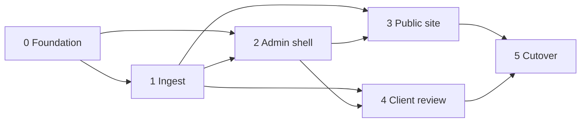

# Implementation

Lean build plan for the Lawson Photography rebuild. Architecture, bindings, and security decisions live in [HLD.md](HLD.md) — this doc sequences work only. Schedule and estimates: [PROGRESS.md](PROGRESS.md), [LOE.md](LOE.md).

## Scope

Sequence the rebuild described in [HLD.md](HLD.md): foundation → ingest → admin → public portfolio → phase-1 client review → cutover.

Out of scope for this plan: LOE numbers, scaffolding/code, and product details still marked `_TBD_` in HLD (exact D1 columns, variant set, public IA polish, cutover source).

## Do not reopen — see HLD

Stack and product decisions are owned by [HLD.md](HLD.md). Do not mirror them here.

Point at HLD for locked decisions:

- [Architecture](HLD.md#architecture) — Astro hybrid SSR on Workers, bindings, R2 S3 credentials/CORS for presigned PUT
- [Key Components](HLD.md#key-components) — public site, admin, client review, Drizzle, `/admin/api/trpc`, Tailwind tokens
- [Admin auth](HLD.md#admin-auth) — Access on `/admin*`; mutations under `/admin/*` + JWT verify
- [Data & Content](HLD.md#data--content) — `PORTFOLIO`/`REVIEW` buckets, ingest sequence, D1 domain split, Worker delivery routes

**Plan-only sequencing rules** (not architecture restatement):

- Every admin mutation stays under `/admin/*` and verifies the Access JWT (shapes Phase 0–2 task boundaries).
- Phase-4 review stays link-secrecy only; a password gate is deferred (shapes Phase 4 scope).

## Phases

One composition of work; later phases depend on earlier foundations. Schedule stays in [PROGRESS.md](PROGRESS.md).

### Phase 0 — Foundation

Stand up the Workers + Astro hybrid app, wrangler bindings, D1 schema skeleton (separate portfolio/review domains), R2 bucket bindings, Tailwind/CSS tokens, and Access wiring for `/admin*`. No feature UI beyond a health/smoke path.

**Tasks**

- [x] Astro hybrid SSR project + `wrangler.jsonc` Workers deploy path ([PR #3](https://github.com/cjlawson02/photography/pull/3))
- [x] D1 database + Drizzle; flat migration layout under `src/db`; portfolio vs review schema modules (no shared photos table) ([PR #6](https://github.com/cjlawson02/photography/pull/6))
- [x] Bind private R2 buckets `PORTFOLIO` and `REVIEW`
- [x] Configure R2 S3 API credentials/secrets and CORS for browser PUT — inventory + CORS IaC in repo; production apply per [DEPLOY.md](DEPLOY.md)
- [x] Tailwind + CSS design tokens (stub/reference values; brand polish `_TBD_` — [PR #9](https://github.com/cjlawson02/photography/pull/9))
- [x] Admin mutations via **`/admin/api/trpc`** (+ **`/admin/api/health`** smoke); not Astro Actions — see [HLD Admin auth](HLD.md#admin-auth) so one Access prefix covers UI + mutations
- [x] Shared Access JWT verification helper for all `/admin/*` handlers; Zero Trust app on `/admin*` — create per [DEPLOY.md](DEPLOY.md)
- [x] Env/secrets inventory for local + prod (`.dev.vars.example`, [DEPLOY.md](DEPLOY.md), [AGENTS.md](../AGENTS.md))

### Phase 1 — Ingest

Original upload via browser presigned PUT, compress-once via Images Free, Worker persists variant bytes under key prefixes, and D1 rows record assets for the target purpose bucket.

**Tasks**

- [x] Admin-only endpoints under `/admin/*` to mint presigned PUT URLs into `PORTFOLIO` or `REVIEW` (JWT verified)
- [x] Browser upload client: PUT to R2, then completion callback to Worker (v1 default per HLD)
- [x] Ingest completion handler: Images Free compress-once → Worker puts variant bytes beside original under key prefixes
- [x] D1 writes for portfolio domain metadata (ids, status, pending/ready/failed) — exact columns `_TBD_` in HLD *(DAO schema: cuid2 `id` / `status` / `mimeType` / timestamps; R2 keys derived from `id`; review photos same + `collectionId`)*
- [x] Reprocess path from original for failed photos (no full status state machine in v1)
- [x] Failure/retry behavior for incomplete PUT or compress failures — log + mark `failed`; reprocess API + portfolio admin **Reprocess** for `pending`/`failed`

### Phase 2 — Admin

Access-gated admin UI and mutations for managing portfolio and (as review lands) review collections. Every mutating route stays under `/admin/*` with JWT verify.

**Tasks**

- [x] Admin shell/layout behind Access ([PR #8](https://github.com/cjlawson02/photography/pull/8))
- [x] Portfolio CRUD/list/publish/hero/sort flows — `/admin/portfolio` + tRPC `portfolio.*`
- [x] Trigger/monitor ingest from admin — `/admin/ingest` smoke UI ([PR #8](https://github.com/cjlawson02/photography/pull/8)); reprocess also on portfolio admin for failed rows
- [x] Review-collection management (create/list/revoke; attach uploads via ingest `collectionId`) — API + admin UI ([PR #8](https://github.com/cjlawson02/photography/pull/8)); revoke in Phase 4
- [x] Confirm no admin mutations exist outside `/admin/*`

### Phase 3 — Public site

Public portfolio pages served from Astro/Workers, reading portfolio D1 + delivering images from private `PORTFOLIO` via Worker media routes (see [HLD delivery](HLD.md#delivery-url-strategy)).

**Tasks**

- [x] Public home hero carousel (Embla + autoplay) + masonry gallery + PhotoSwipe lightbox (`gallery.webp`; published/ready D1, `/media/portfolio` variants) — [PR #13](https://github.com/cjlawson02/photography/pull/13)
- [ ] Public routes matching live UX DNA beyond home; exact page inventory `_TBD_`
- [x] Public home shell: `PublicLayout`, header/footer, placeholder hero + gallery grid, static category filter chips ([PR #10](https://github.com/cjlawson02/photography/pull/10))
- [x] Portfolio queries (published-only) from D1 portfolio domain — `listPublishedPortfolioPhotos` on home
- [x] Worker route `/media/portfolio/{id}/{variant}` — allowlisted variant suffixes only; long `Cache-Control` / CDN cache ([PR #10](https://github.com/cjlawson02/photography/pull/10))
- [x] SEO basics for public portfolio pages — home meta description, canonical, Open Graph (`src/lib/site/public-meta.ts`); review `noindex` in Phase 4
- [x] Responsive layout using tokens from Phase 0 (public shell slice — [PR #10](https://github.com/cjlawson02/photography/pull/10))

### Phase 4 — Client review (phase 1)

Shareable review links protected by secrecy only. Media via Worker `/media/review/...`. No password gate in v1; design so one can be added later.

**Tasks**

- [x] Review Drizzle module/tables: collections, review photos, `selectionStatus` (Phase 2 / [PR #6](https://github.com/cjlawson02/photography/pull/6))
- [x] Create/revoke review links from admin (tRPC `review.collections.create` / `review.collections.revoke`)
- [x] Public review page at `/review/{slug}` — link secrecy only; select/approve via `POST /review/api/selection`
- [x] Worker route `/media/review/{id}/{variant}` serving from `REVIEW` bucket (allowlisted variants)
- [x] `noindex` meta + `robots.txt` Disallow for review surfaces
- [x] On review revoke: optional R2 cleanup + shorter `/media/review` cache TTL than portfolio
- [x] Extension point for future password gate — `resolveReviewCollectionAccess` in `src/lib/review/collection-access.ts`

### Phase 5 — Cutover

Move traffic/content from the current site to the new Workers deployment. Runbook: [CUTOVER.md](CUTOVER.md).

**Tasks**

- [ ] Content/asset migration plan from legacy source (`_TBD_`)
- [ ] DNS / custom domain / Access production checklist (`_TBD_`)
- [x] Smoke tests checklist — [SMOKE.md](SMOKE.md) (manual; automation `_TBD_`)
- [ ] Rollback notes (`_TBD_`)

### Phase 2.5 — Post-MVP backlog

Tracked after [#21](https://github.com/cjlawson02/photography/pull/21)–[#23](https://github.com/cjlawson02/photography/pull/23) reviews. Not blocking cutover; pick up in focused PRs.

| ID | Item | Notes |
| --- | --- | --- |
| B3 | Admin review selections + photos view | tRPC/UI for `ReviewPhotos` / `selectionStatus`; `review.collections.detail` |
| S1 | Review slug hardening | Server-generated or min-length URL-safe slugs |
| S2 | Rate-limit `/review/api/selection` | Workers rate-limit binding |
| S4 | Delete / revoke ordering | Done — R2 `deleteObjects` batch; revoke `db.batch`; portfolio/review R2-before-D1 |
| S6 | Security headers | Done — Astro `src/middleware.ts` + `src/lib/http/security-headers.ts` |
| P1 | Ingest dimensions | **Done** — `width`/`height` on `PortfolioPhotos` / `ReviewPhotos` via Images `info()` at ingest complete; admin portfolio + review detail; public home masonry + review gallery (`aspect-ratio`, PhotoSwipe) with 1600×1200 fallback when null. Alt/title → P2 |
| P2–P7 | Product polish | Alt/title, empty states, review lifecycle, upload hardening, pending TTL, admin pagination — see [HLD](HLD.md) `_TBD_` |
| M1–M4 | Frontend islands + primitives | Query islands on admin portfolio/review/ingest; **M2** — removed `lib/admin/portfolio-api.ts` and `review-collections-api.ts` (router output types in `trpc-types.ts`); shared UI primitives + optional `embla-carousel-react` `_TBD_` |
| T1 | Test suite | **Partial** — node:test for `POST /review/api/selection` (`post-selection.ts`), security headers, tRPC rate-limit middleware; RTL + Vitest migration `_TBD_` |
| T4 | D1 migrations in CI | Pre-deploy apply on `main` in [ci-cd.yml](../.github/workflows/ci-cd.yml); optional gate / PR dry-run `_TBD_` |
| T5 | Indexes | Done — migration `0002_*`; `ReviewPhotos.collectionId`, `PortfolioPhotos(published, status)` |
| T6–T7 | Cutover + bulk migration | [CUTOVER.md](CUTOVER.md); legacy WP migration deferred |
| O1 | Sentry | **Partial** — Worker entry (`sentry.server.config.ts`), `SENTRY_DSN` secret + `SENTRY_RELEASE` from CI deploy ([DEPLOY.md](DEPLOY.md)); unhandled fetch errors + tRPC/HTTP 5xx capture. _Remaining:_ browser SDK; Sentry source-map upload for Worker bundles (optional `wrangler deploy --upload-source-maps` / release artifacts — not wired in CI yet) |

## Dependencies

| Depends on | For |
| --- | --- |
| Remaining HLD `_TBD_`s (columns, variant set, IA polish, cutover) | Tighten later phases — **not** required to start Phase 0 scaffold |
| R2 S3 API secrets + CORS | Browser presigned PUT |
| Cloudflare Access application for `/admin*` | Admin shell and all mutations |
| Images Free (compress) entitlement | Ingest pipeline |
| [LOE.md](LOE.md) | Effort — **do not invent numbers here** |

## Risks

| Risk | Mitigation direction |
| --- | --- |
| Presigned PUT CORS / credential misconfig | Prove upload smoke in Phase 0/1 before admin UI polish |
| Accidental public exposure of review media | Private `REVIEW` bucket; Worker-only delivery; `noindex`; purge/TTL |
| Admin mutation reachable without Access JWT | Mount under `/admin/*`; verify JWT on every mutation; deny by default |
| Scope creep into passworded review, hosted Images storage, or extra buckets | Explicitly deferred in HLD; phase-1 link secrecy only |
| Column/IA `_TBD_` churn after scaffold | Keep Phase 0 schema as empty domain modules; refine columns before Phase 1–3 polish |

## Open questions

Answered in HLD (do not reopen here): stack host (Workers), bucket split, Worker delivery routes (`/media/portfolio/...`, `/media/review/...`), Access+JWT admin model, ingest v1 completion callback, Images Free compress-once, no tRPC / no hosted Images storage, phase-1 link-secrecy review.

Still need Chris / HLD before *tightening* later phases (scaffold can proceed with stubs):

1. **Exact D1 columns** within portfolio vs review domains — `_TBD_` in HLD
2. **Public IA & portfolio model** — Which pages/sections ship in v1? Album vs single-image vs mixed?
3. **Ingest variant set** — Which widths/formats after Images Free compress-once?
4. **Post-upload trigger alternatives** — R2 event notification or admin “process” action vs v1 browser callback (`_TBD_` alternatives only)
5. **Review TTL default** — Duration; purge-on-delete vs expiry-only (HLD requires purge and/or shorter TTL hygiene)
6. **Legacy cutover source** — Where do existing assets/content live today?
7. **Brand / visual direction** — Token values and type choices (Phase 0 can stub tokens first)
8. **Second D1 database** — Only if isolation requirements change (HLD default: one D1, table boundary only)

Resolve in HLD (or explicitly defer); do not invent answers in this file.
