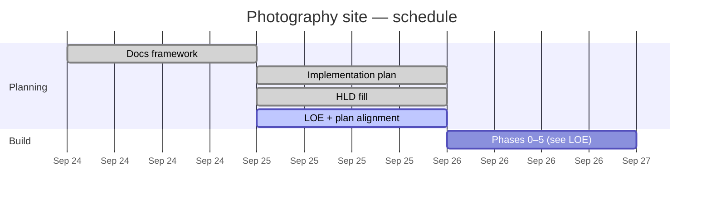

# Progress

## Status

| Area | Status | Notes |
| --- | --- | --- |
| Documentation framework | Done | Initial scaffold |
| High-level design | Done | Stack and delivery locked in [HLD.md](HLD.md); remaining `_TBD_` listed there |
| Implementation plan | Done | Phases 0–5 in [IMPLEMENTATION.md](IMPLEMENTATION.md) ([PR #1](https://github.com/cjlawson02/photography/pull/1)); aligned to filled HLD |
| Level of effort | Done | Rough phase/task sizes in [LOE.md](LOE.md) |
| Site build / scaffolding | Not started | HLD is filled enough to start Phase 0; remaining `_TBD_`s do not block scaffold |

Canonical plan: [IMPLEMENTATION.md](IMPLEMENTATION.md). Estimates: [LOE.md](LOE.md). Architecture: [HLD.md](HLD.md).

## Schedule

Planning sequence only. **Build phase durations are `_TBD_`** — do not treat bars as calendar commitments. Relative effort: [LOE.md](LOE.md).

## Changelog

| Date | Update |
| --- | --- |
| 2026-09-25 | Aligned Progress/LOE/IMPLEMENTATION to filled HLD; scaffolding unblocked (remaining `_TBD_`s are non-blocking) |
| 2026-09-25 | HLD filled on main: Workers Astro, PORTFOLIO+REVIEW R2, Worker media routes, Access+JWT, Drizzle domains |
| 2026-09-25 | LOE rough sizes drafted; Progress/Gantt updated |
| 2026-09-25 | IMPLEMENTATION.md phases 0–5 approved/merged (PR #1) |
| 2026-09-24 | Initial docs framework created |
| 2026-09-24 | Added Mermaid diagram and Gantt chart stubs |
| 2026-09-24 | Added AGENTS.md; Gantt owned by Progress (DRY) |
| 2026-09-24 | Aligned AGENTS.md with agents.md best practices |
