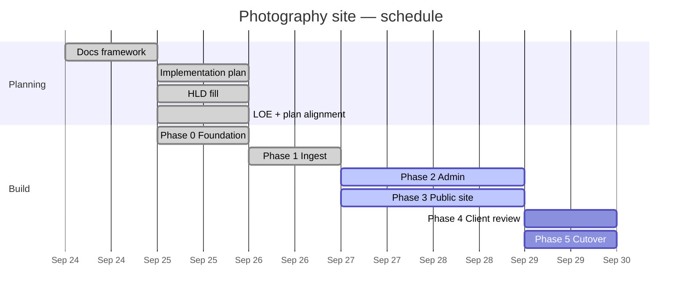

# Progress

## Status

| Area | Status | Notes |
| --- | --- | --- |
| Documentation framework | Done | Initial scaffold |
| High-level design | Done | Stack and delivery locked in [HLD.md](HLD.md); remaining `_TBD_` listed there |
| Implementation plan | Done | Phases 0–5 in [IMPLEMENTATION.md](IMPLEMENTATION.md) ([PR #1](https://github.com/cjlawson02/photography/pull/1)); aligned to filled HLD |
| Level of effort | Done | Rough phase/task sizes in [LOE.md](LOE.md) |
| Phase 0 — Foundation | Done | Astro Workers scaffold ([PR #3](https://github.com/cjlawson02/photography/pull/3)); data layer ([PR #6](https://github.com/cjlawson02/photography/pull/6)) |
| Phase 1 — Ingest | Done | Presign + complete + reprocess ([PR #7](https://github.com/cjlawson02/photography/pull/7)) |
| Phase 2 — Admin | In progress | Shell, review collections API/UI, ingest UI ([PR #8](https://github.com/cjlawson02/photography/pull/8)); portfolio CRUD/publish still open |
| Phase 3 — Public site | In progress | Home Embla hero (autoplay), masonry grid + PhotoSwipe lightbox (`gallery` variant), `/media/portfolio` delivery; further public routes `_TBD_` |
| Phase 4 — Client review | Not started | Public `/review/{slug}`, `/media/review`, `noindex` — see [IMPLEMENTATION.md](IMPLEMENTATION.md) Phase 4 |

Production host live (`photography.chrislawson.dev`): Access `/admin*`, D1 remote migrations, R2 CORS, Access vars + R2 secrets — [DEPLOY.md](DEPLOY.md).

Phases intentionally overlap: admin review tooling lands before public review surfaces; portfolio media delivery precedes full public IA and portfolio CRUD.

Canonical plan: [IMPLEMENTATION.md](IMPLEMENTATION.md). Estimates: [LOE.md](LOE.md). Architecture: [HLD.md](HLD.md).

## Schedule

Planning sequence only. **Build phase durations are `_TBD_`** — do not treat bars as calendar commitments. Relative effort: [LOE.md](LOE.md).

## Changelog

| Date | Update |
| --- | --- |
| 2026-09-25 | First production deploy: custom domain, Access Public DNS `/admin*`, Access vars in wrangler, R2 secrets + CORS, D1 remote; [DEPLOY.md](DEPLOY.md) updated |
| 2026-09-25 | Progress/IMPLEMENTATION sync through [PR #10](https://github.com/cjlawson02/photography/pull/10): Phase 1 done; Phase 2/3 partial; Gantt + status table |
| 2026-09-25 | Public shell + `/media/portfolio` + deploy hostname docs ([PR #10](https://github.com/cjlawson02/photography/pull/10)); WP reference tokens ([PR #9](https://github.com/cjlawson02/photography/pull/9)) |
| 2026-09-25 | Phase 2 admin shell: layout, review collection create/list API, ingest under `/admin/ingest` ([PR #8](https://github.com/cjlawson02/photography/pull/8)) |
| 2026-09-25 | Phase 1 ingest merged ([PR #7](https://github.com/cjlawson02/photography/pull/7)) |
| 2026-09-25 | Phase 1 ingest redo on FamilyNotes-style DAOs (presign/complete/reprocess; review `collectionId`) |
| 2026-09-25 | Data layer aligned to FamilyNotes-style DAOs/schema ([PR #6](https://github.com/cjlawson02/photography/pull/6)) |
| 2026-09-25 | Phase 0 merged; Phase 1 ingest superseded pending data-layer redo |
| 2026-09-25 | Aligned Progress/LOE/IMPLEMENTATION to filled HLD; scaffolding unblocked (remaining `_TBD_`s are non-blocking) |
| 2026-09-25 | HLD filled on main: Workers Astro, PORTFOLIO+REVIEW R2, Worker media routes, Access+JWT, Drizzle domains |
| 2026-09-25 | LOE rough sizes drafted; Progress/Gantt updated |
| 2026-09-25 | IMPLEMENTATION.md phases 0–5 approved/merged (PR #1) |
| 2026-09-24 | Initial docs framework created |
| 2026-09-24 | Added Mermaid diagram and Gantt chart stubs |
| 2026-09-24 | Added AGENTS.md; Gantt owned by Progress (DRY) |
| 2026-09-24 | Aligned AGENTS.md with agents.md best practices |
