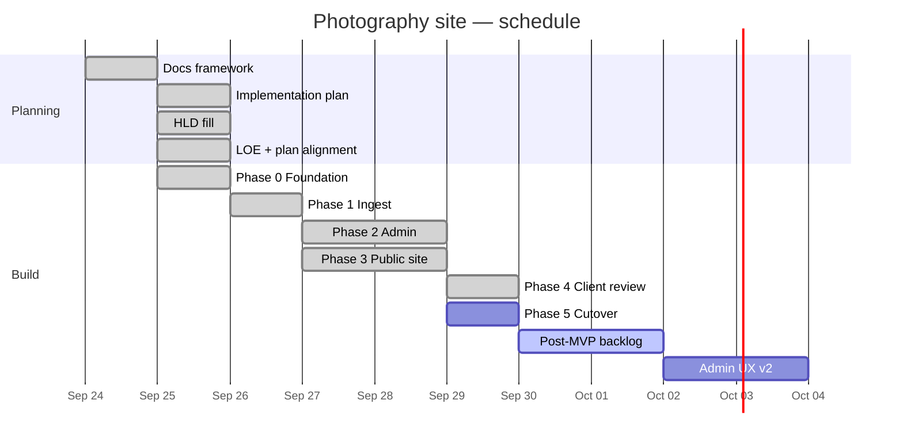

# Progress

## Status

| Area | Status | Notes |
| --- | --- | --- |
| Documentation framework | Done | Initial scaffold |
| High-level design | Done | Stack and delivery locked in [HLD.md](HLD.md); remaining `_TBD_` listed there |
| Implementation plan | Done | Phases 0–5 in [IMPLEMENTATION.md](IMPLEMENTATION.md) ([PR #1](https://github.com/cjlawson02/photography/pull/1)); aligned to filled HLD |
| Level of effort | Done | Rough phase/task sizes in [LOE.md](LOE.md) |
| Phase 0 — Foundation | Done | Astro Workers scaffold ([PR #3](https://github.com/cjlawson02/photography/pull/3)); data layer ([PR #6](https://github.com/cjlawson02/photography/pull/6)) |
| Phase 1 — Ingest | Done | Presign + complete + reprocess ([PR #7](https://github.com/cjlawson02/photography/pull/7)) |
| Phase 2 — Admin | Done | Portfolio/review admin, tRPC, inline upload, M3 primitives, M6 SSR initial reads; post-MVP in [IMPLEMENTATION.md](IMPLEMENTATION.md#phase-25--post-mvp-backlog) |
| Admin UX v2 | Planned | Workflows/patterns in [ADMIN-UX.md](ADMIN-UX.md); build sequence [IMPLEMENTATION.md](IMPLEMENTATION.md#phase-26--admin-ux-v2) |
| Phase 3 — Public site | Done (MVP) | Home + React islands, SEO meta on home; extra public routes + brand tokens `_TBD_` |
| Phase 4 — Client review | Done (phase 1) | `/review/{slug}`, React gallery, selection API, admin revoke, `noindex` + robots |
| Post-MVP hardening | In progress | O1 Sentry, security audit ([#51](https://github.com/cjlawson02/photography/pull/51)–[#52](https://github.com/cjlawson02/photography/pull/52)); open backlog Phase 2.5 |
| Phase 5 — Cutover | In progress | Custom domain + legacy 301 live; runbook [CUTOVER.md](CUTOVER.md); remote migrate / bulk import pending |

Production host live (`photography.chrislawson.dev`): Access `/admin*`, D1 remote migrations, R2 CORS, Access vars + R2 secrets — [DEPLOY.md](DEPLOY.md).

Phases intentionally overlap: admin review tooling lands before public review surfaces; portfolio media delivery precedes full public IA and portfolio CRUD.

Canonical plan: [IMPLEMENTATION.md](IMPLEMENTATION.md). Estimates: [LOE.md](LOE.md). Architecture: [HLD.md](HLD.md). Admin workflows: [ADMIN-UX.md](ADMIN-UX.md).

## Schedule

Planning sequence only. **Build phase durations are `_TBD_`** — do not treat bars as calendar commitments. Relative effort: [LOE.md](LOE.md).

## Changelog

| Date | Update |
| --- | --- |
| 2026-09-25 | Admin UX v2 spec: [ADMIN-UX.md](ADMIN-UX.md); Phase 2.6 planned in [IMPLEMENTATION.md](IMPLEMENTATION.md#phase-26--admin-ux-v2) |
| 2026-09-26 | Docs sync: PROGRESS status/Gantt; [SMOKE.md](SMOKE.md) admin SSR; audit backlog in IMPLEMENTATION S7–R2 |
| 2026-09-26 | [#50](https://github.com/cjlawson02/photography/pull/50) M6 admin SSR initial reads; [#51](https://github.com/cjlawson02/photography/pull/51)–[#52](https://github.com/cjlawson02/photography/pull/52) security audit fixes |
| 2026-09-26 | [#49](https://github.com/cjlawson02/photography/pull/49) O1 Sentry browser + CI source maps; [#46](https://github.com/cjlawson02/photography/pull/46)–[#47](https://github.com/cjlawson02/photography/pull/47) M3 + Vitest/RTL |
| 2026-09-26 | Refresh [IMPLEMENTATION.md](IMPLEMENTATION.md) Phase 2.5 table (shipped vs open backlog) |
| 2026-09-26 | [#27](https://github.com/cjlawson02/photography/pull/27) Phase 2.5 S1 server review slugs + S2 selection rate limit; hashed-IP limits + `ADMIN_TRPC_RATE_LIMITER` on ingest tRPC |
| 2026-09-26 | CD: `wrangler d1 migrations apply photography --remote` before Worker deploy on push to `main`; [DEPLOY.md](DEPLOY.md) |
| 2026-09-26 | Phase 2.5 S6 security headers (CSP middleware) + T5 D1 indexes (`ReviewPhotos.collectionId`, `PortfolioPhotos` published/status) |
| 2026-09-26 | B3: admin review collection detail — `review.collections.detail`, `/admin/review/collections/{id}` inspect UI |
| 2026-09-26 | Post-MVP hardening PR: media D1 gate, portfolio cache-bust, hero pause, admin fetch/tRPC polish; [IMPLEMENTATION.md](IMPLEMENTATION.md) Phase 2.5 backlog |
| 2026-09-26 | [#23](https://github.com/cjlawson02/photography/pull/23) Oxlint + oxfmt; [#22](https://github.com/cjlawson02/photography/pull/22) frontend P0 + portfolio Query; [#21](https://github.com/cjlawson02/photography/pull/21) tRPC hardening, REST removed |
| 2026-09-26 | Phase 2.5 P6: lazy stale pending cleanup on admin lists (no cron); admin filter |
| 2026-09-26 | Open items batch: portfolio reprocess UX, home SEO meta, [SMOKE.md](SMOKE.md); IMPLEMENTATION checklist sync |
| 2026-09-25 | First production deploy: custom domain, Access Public DNS `/admin*`, Access vars in wrangler, R2 secrets + CORS, D1 remote; [DEPLOY.md](DEPLOY.md) updated |
| 2026-09-25 | Phase 4 client review phase 1: public `/review/{slug}`, `/media/review`, selection UX, admin revoke |
| 2026-09-25 | Progress/IMPLEMENTATION sync through [PR #10](https://github.com/cjlawson02/photography/pull/10): Phase 1 done; Phase 2/3 partial; Gantt + status table |
| 2026-09-25 | Public shell + `/media/portfolio` + deploy hostname docs ([PR #10](https://github.com/cjlawson02/photography/pull/10)); WP reference tokens ([PR #9](https://github.com/cjlawson02/photography/pull/9)) |
| 2026-09-25 | Phase 2 admin shell: layout, review collection create/list API, ingest under `/admin/ingest` ([PR #8](https://github.com/cjlawson02/photography/pull/8)) |
| 2026-09-25 | Phase 1 ingest merged ([PR #7](https://github.com/cjlawson02/photography/pull/7)) |
| 2026-09-25 | Phase 1 ingest redo on FamilyNotes-style DAOs (presign/complete/reprocess; review `collectionId`) |
| 2026-09-25 | Data layer aligned to FamilyNotes-style DAOs/schema ([PR #6](https://github.com/cjlawson02/photography/pull/6)) |
| 2026-09-25 | Phase 0 merged; Phase 1 ingest superseded pending data-layer redo |
| 2026-09-25 | Aligned Progress/LOE/IMPLEMENTATION to filled HLD; scaffolding unblocked (remaining `_TBD_`s are non-blocking) |
| 2026-09-25 | HLD filled on main: Workers Astro, PORTFOLIO+REVIEW R2, Worker media routes, Access+JWT, Drizzle domains |
| 2026-09-25 | LOE rough sizes drafted; Progress/Gantt updated |
| 2026-09-25 | IMPLEMENTATION.md phases 0–5 approved/merged (PR #1) |
| 2026-09-24 | Initial docs framework created |
| 2026-09-24 | Added Mermaid diagram and Gantt chart stubs |
| 2026-09-24 | Added AGENTS.md; Gantt owned by Progress (DRY) |
| 2026-09-24 | Aligned AGENTS.md with agents.md best practices |
