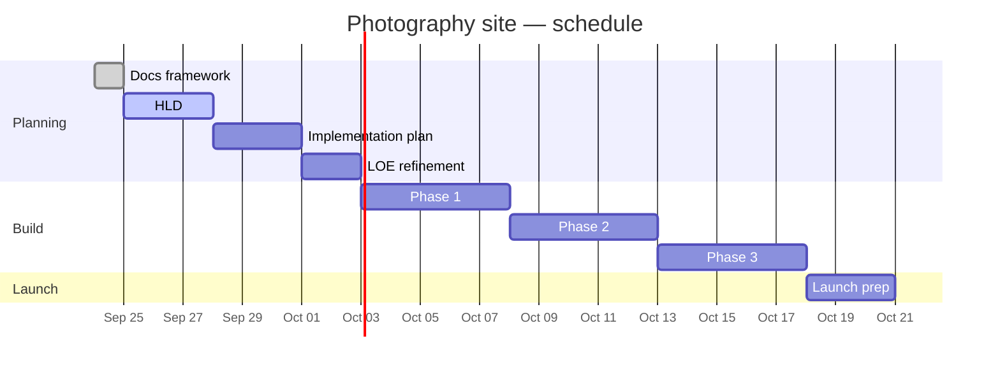

# Progress

## Status

| Area | Status | Notes |
| --- | --- | --- |
| Documentation framework | Done | Initial scaffold |
| Mermaid / Gantt stubs | Done | See HLD, Implementation, Progress |
| High-level design | Not started | — |
| Implementation plan | Not started | — |
| Level of effort | Not started | — |
| Site build | Not started | — |

## Schedule

_TBD_ — dates and task names below are placeholders.

## Changelog

| Date | Update |
| --- | --- |
| 2026-09-24 | Initial docs framework created |
| 2026-09-24 | Added Mermaid diagram and Gantt chart stubs |
| 2026-09-24 | Added AGENTS.md; Gantt owned by Progress (DRY) |
| 2026-09-24 | Aligned AGENTS.md with agents.md best practices |
